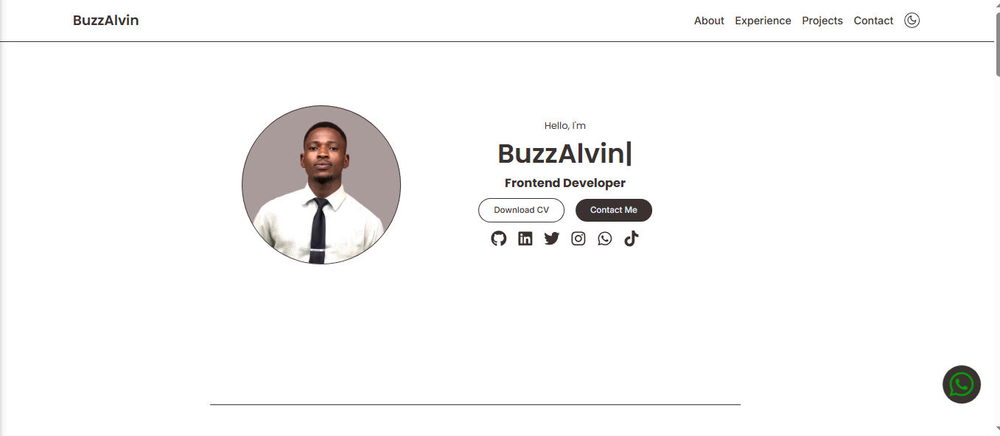

# 🌐 BuzzAlvin Portfolio Website

A modern and responsive portfolio website built with React to showcase my projects, skills, and contact information.

## 🚀 Live Demo
https://buzzalvin.netlify.app/

## Screenshoot 

## 📌 Features

- Responsive design
- Smooth animations with Framer Motion
- Contact form with EmailJS
- Social media links
- Modern UI
- Light and Dark Mode
- Project showcase section
- Experience section
- About section

## 🛠️ Tech Stack

- React
- CSS Modules
- Framer Motion
- EmailJS
- React Icons
- Vite
- JavaScript (ES6+)

##  📷 Sections

- Hero Section
- About Me
- Tech Stack
- Projects
- Contact

##  📦Installation

- git clone https://github.com/BuzzAlvin/portfolio

Go into the project:

- cd your-repo-name

Install dependencies:

- npm install

Run the project:

- npm start

## 🔐 Environment Variables

- Create a .env file in the root folder and add:

REACT_APP_EMAILJS_SERVICE_ID=your_service_id
REACT_APP_EMAILJS_TEMPLATE_ID=your_template_id
REACT_APP_EMAILJS_PUBLIC_KEY=your_public_key

## 📬 Contact
If you'd like to collaborate or work with me:

- Email: buzzalvin01@gmail.com
- GitHub: https://github.com/BuzzAlvin
- LinkedIn: https://linkedin.com/in/buzzalvin

## 🧠 What I Learned
- Component based architecture in React
- Responsive layout structuring 
- Framer Motion animations
- Darkmode implementation with CSS variables
- EmailJS integration for contact form
- Clean project organization

## 📄 License
This project is open source and available under the MIT License.

---

⭐ If you like this project, feel free to star the repository.